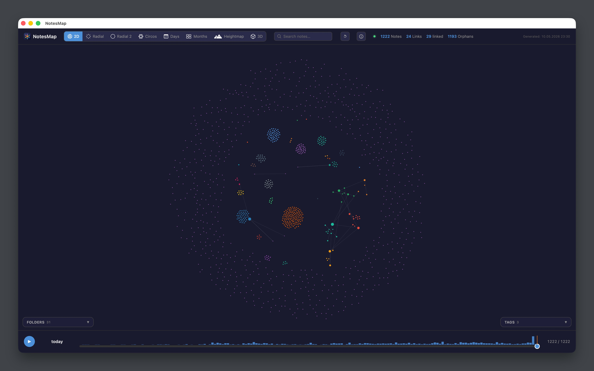
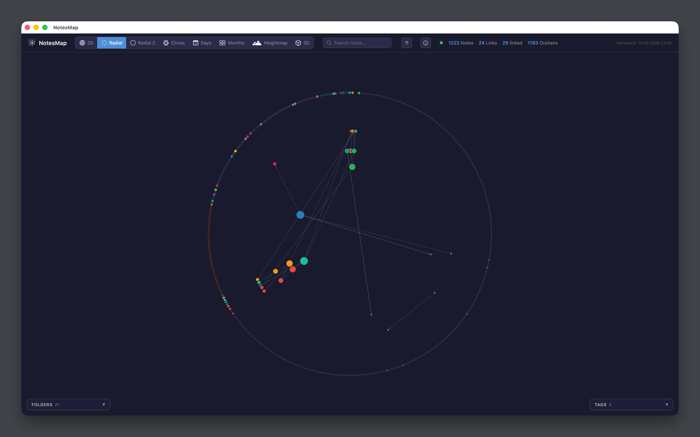
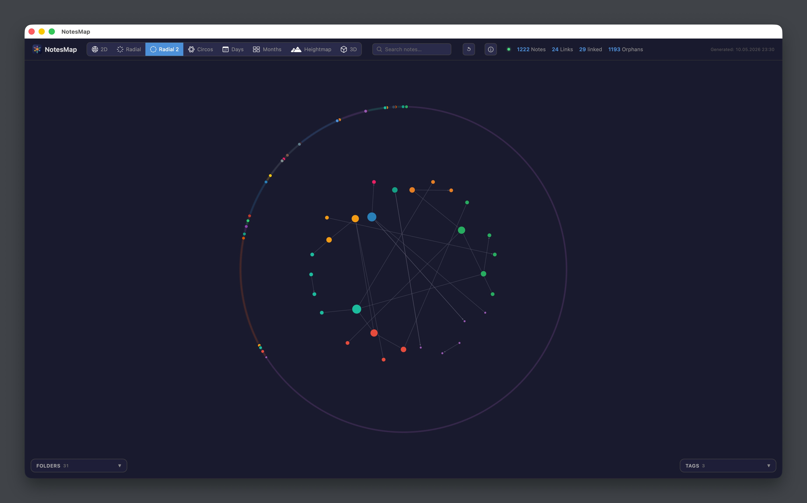
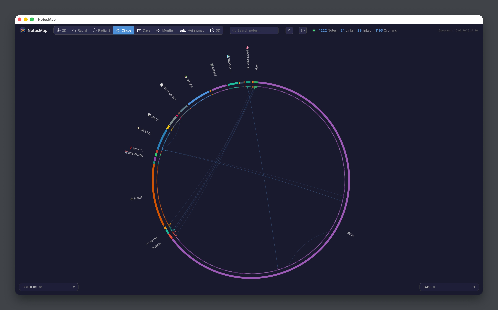
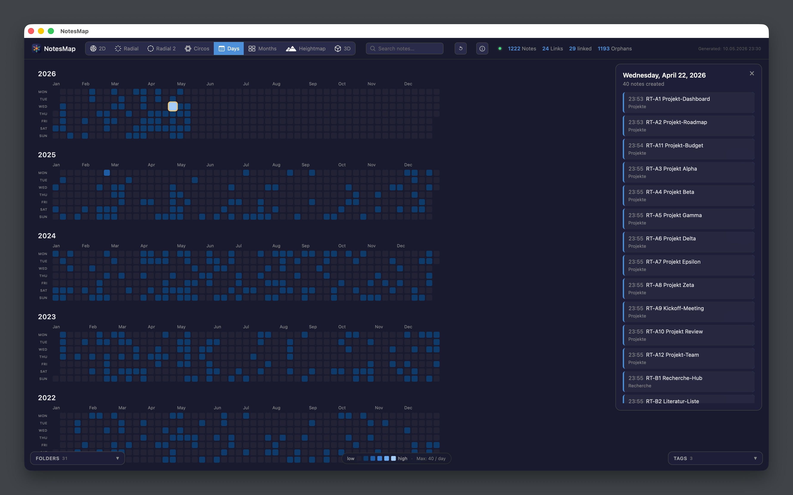
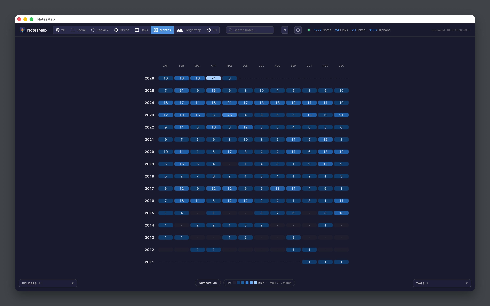
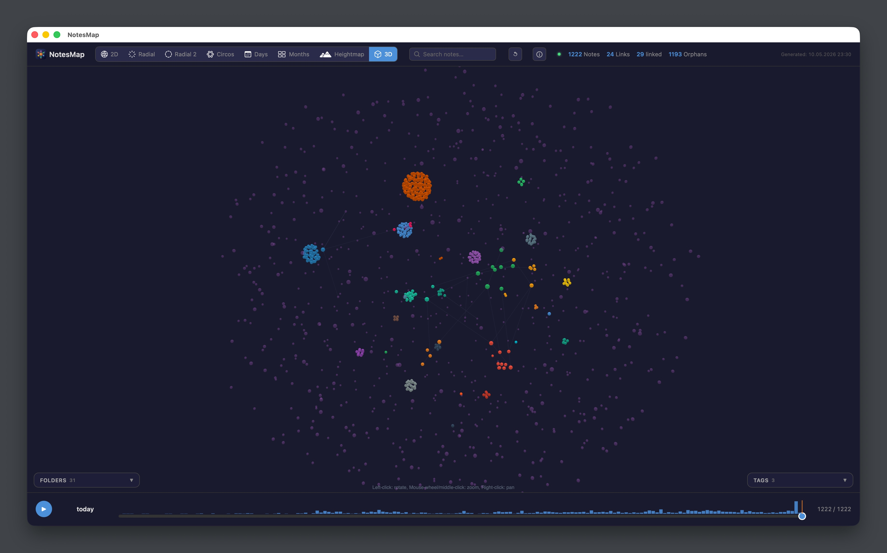
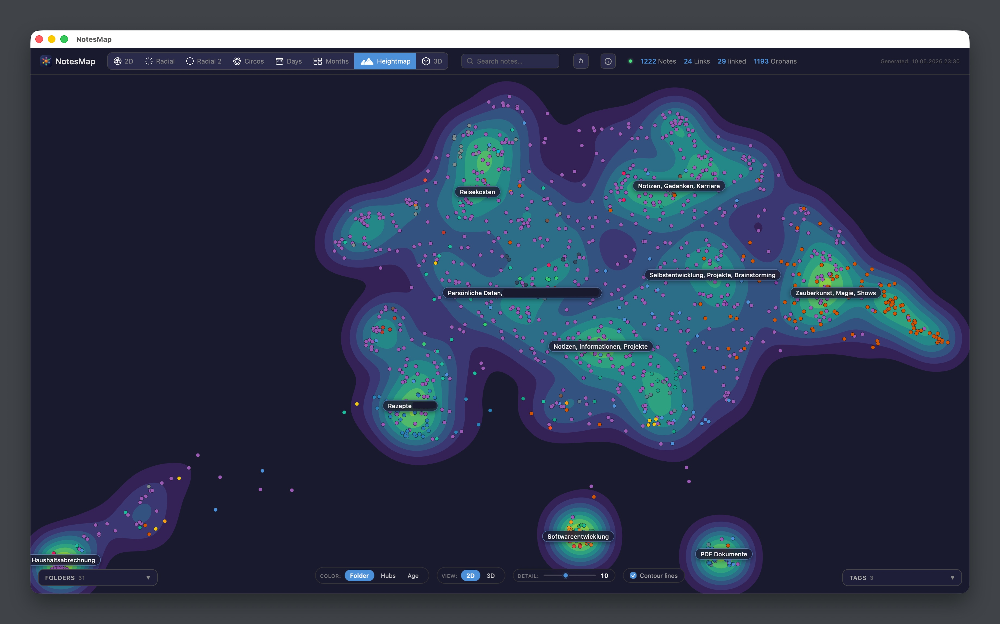
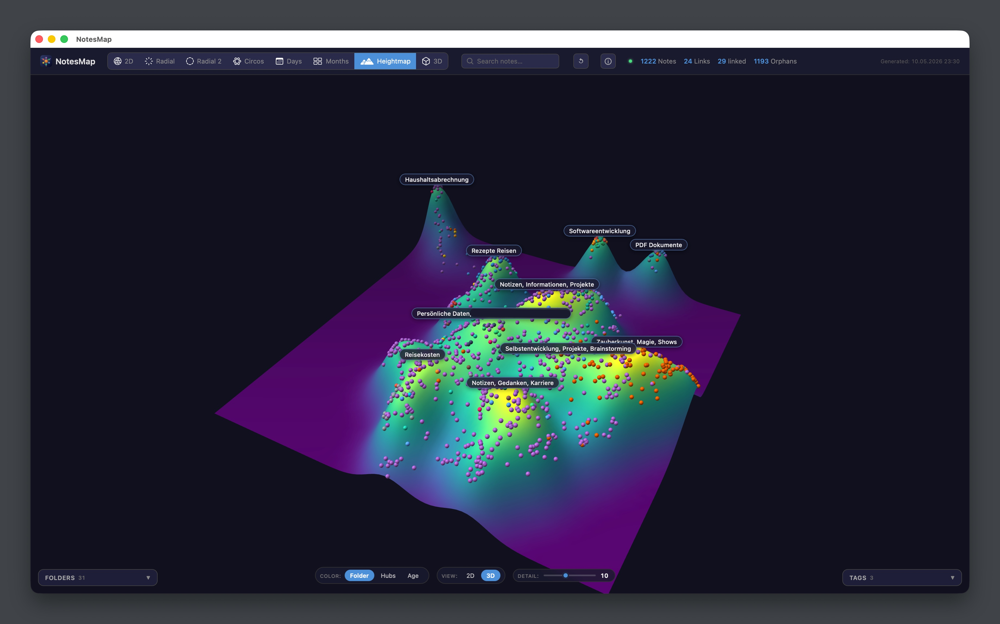

# NotesMap

A native macOS app that visualizes your Apple Notes as an interactive graph, folders, links, tags, and semantic clusters at a glance.

Built with SwiftUI, WKWebView, D3.js, and Three.js. Reads the local Notes SQLite store directly (read-only). Optional Ollama integration for AI-generated cluster labels.

> macOS 14 (Sonoma) or newer. Requires Full Disk Access. ~1,200 notes load in under 2 seconds.

---

Apple Notes is great for capture but offers no overview. Once you have a few hundred notes, finding patterns, "which notes cluster around topic X?", "what are my hub notes?", "which orphans should I link?", is impossible from the standard UI.

This app gives you **eight different views** of the same dataset. Each is interactive, pan, zoom, click a node to open the note in Apple Notes, ⌘+click to deep-link.

| View | Description |
|---|---|
| **2D force layout** | Physics-based graph, drag to explore, hover for backlinks |
| **Radial** | Folders as pie sectors, hubs at center, classic concentric layout |
| **Radial 2** | Orphans as outer halo, linked clusters get the inner space |
| **Circos plot** | Folders as arc segments, links as Bezier bundles through the center, hub-score as inward radial bars |
| **Days** | One cell per day, year stacks, note volume heatmap |
| **Months** | Years × months grid heatmap |
| **3D force graph** | Three.js-based 3D node cloud with camera controls |
| **Heightmap** | Semantic terrain via UMAP + KDE; peaks are clusters of similar notes. Requires Ollama for embeddings and AI-generated labels. |

Filter by folder, tag, or time slice. The time-slider also works as a "time machine", see the graph as it looked at any past date.

---

## Screenshots

### 2D Force-Graph

The default view. Notes are nodes, links are springs. Folder color, hub size from incoming + outgoing links.



### The other seven

<table>
  <tr>
    <td width="50%"></td>
    <td width="50%"></td>
  </tr>
  <tr>
    <td><b>Radial</b><br>Folders as pie sectors, hubs sit near the center. Long Bezier strings across the middle reveal cluster bridges.</td>
    <td><b>Radial 2 (Halo)</b><br>Orphans drift to the outer ring; the inner space is reserved for linked clusters. Makes connection structures very visible.</td>
  </tr>
  <tr>
    <td></td>
    <td></td>
  </tr>
  <tr>
    <td><b>Circos plot</b><br>Borrowed from genomics. Folders become arc segments, links are Bezier curves through the center, hub-score as inward radial bars.</td>
    <td><b>Days</b><br>One cell per day, years stacked. Click a day to see all notes from that day in a side panel.</td>
  </tr>
  <tr>
    <td></td>
    <td></td>
  </tr>
  <tr>
    <td><b>Months</b><br>One cell per month, years as rows. Long-term writing rhythms become obvious.</td>
    <td><b>3D Force-Graph</b><br>The graph in three dimensions via Three.js. Each cluster occupies its own volume instead of overlapping others.</td>
  </tr>
  <tr>
    <td></td>
    <td></td>
  </tr>
  <tr>
    <td><b>Heightmap (2D)</b><br>Topic terrain via local AI: notes are embedded with Ollama, projected with UMAP, density turned into mountains via KDE. AI-generated cluster labels.</td>
    <td><b>Heightmap (3D)</b><br>Same data, rotated into a 3D landscape. Mountains are dense topic clusters, valleys are sparse areas.</td>
  </tr>
</table>

---

## Features

- **Auto-updates**, Sparkle checks the appcast feed every 24h; "Check for Updates…" lives in the NotesMap menu
- **Live updates from Apple Notes**, `NoteStoreWatcher` detects edits and refreshes the visible graph automatically
- **Folder & tag filtering** with multi-select and AND/OR/NOT logic
- **Full-text search** across note bodies (gzip-protobuf decoded), titles, and folder names
- **Time-machine slider**, view the graph as it looked at any past date
- **Hub-score visualization**, radial bars whose length scales with link count
- **Optional AI cluster labels** via Ollama (more on this below)
- **Persistent label cache**, Ollama-generated labels are SHA256-keyed and survive restarts
- **Bilingual**, German or English, switchable in Settings (Cmd+,) → Language. App shell, onboarding, settings, error messages, all WebView labels/tooltips/status messages, and the calendar/monthly month names are fully translated.

---

## Installation

### Option A: Download a release (recommended)

1. Download the latest `.dmg` from the [Releases page](https://github.com/floriankuemmel/notesmap-mac/releases)
2. Open it and drag **NotesMap** into your `Applications` folder
3. On first launch, macOS may ask you to confirm the developer, if you're on a build that isn't yet notarized, right-click the app and choose **Open**, then **Open** again in the dialog
4. Grant Full Disk Access (see below) and you're done

### Option B: Build from source

```bash
# Prerequisites
brew install xcodegen   # if not already installed

# Build
git clone https://github.com/floriankuemmel/notesmap-mac.git
cd notesmap-mac
xcodegen generate       # creates NotesMap.xcodeproj
open NotesMap.xcodeproj
```

In Xcode, choose the `NotesMap` scheme and run (⌘R). For a release build:

```bash
xcodebuild -project NotesMap.xcodeproj \
           -scheme NotesMap \
           -configuration Release \
           build
```

---

## Required: Full Disk Access

The app reads `~/Library/Group Containers/group.com.apple.notes/NoteStore.sqlite` directly. macOS protects this file behind Full Disk Access.

**Steps:**
1. Open **System Settings** → **Privacy & Security** → **Full Disk Access**
2. Click the **+** button
3. Navigate to and select **NotesMap**
4. Toggle the switch on
5. Restart the app

If you skip this step the app shows an error message with a button that opens this exact settings page for you.

The app **never writes** to the database. It is opened with `mode=ro` and `pragma query_only=ON`. There is no scenario in which this app modifies your Notes data.

---

## Optional: Ollama for AI features

Two features depend on a local LLM via [Ollama](https://ollama.com):

1. **Semantic embeddings** for the heightmap clustering (`bge-m3` model)
2. **Cluster labels**, short human-readable descriptions of each peak (`gemma2:9b` model)

**Without Ollama**, the app works fully, you just see the heightmap with colored peaks but no automatic labels. You can still hover any peak to see its top notes.

### Why Ollama and not the cloud?

Your notes never leave your machine. No API key, no per-token cost, no privacy compromise. The price is local disk space and one-time setup.

### Step-by-step setup

#### 1. Install Ollama

Go to [ollama.com](https://ollama.com), download the macOS app, and drag it into Applications. Launch it once, it sits in your menu bar.

#### 2. Pull the models

Open Terminal and run:

```bash
# Embeddings model (~1.2 GB)
ollama pull bge-m3

# Cluster-label generator (~5.4 GB)
ollama pull gemma2:9b
```

Total: about 6.6 GB on disk. Models live in `~/.ollama/models`.

#### 3. Verify

```bash
# Should print "Ollama is running"
curl -s http://localhost:11434
```

#### 4. Use the heightmap

In NotesMap, click the **Heightmap** view button. The app:
- Embeds all notes via `bge-m3` (one-time, ~1 minute for 1,200 notes)
- Reduces to 2D via UMAP and computes a Kernel Density Estimate
- Sends each peak's top notes to `gemma2:9b` for a 3-5 word label
- Caches each label by SHA256(model + sorted titles + sorted snippets) so you only pay the LLM cost once per cluster

The cache lives at `~/Library/Application Support/NotesMap/peak-labels.json`.

### Tight on disk space?

Smaller alternatives that work fine:

```bash
ollama pull nomic-embed-text   # ~274 MB (replaces bge-m3)
ollama pull gemma2:2b          # ~1.6 GB (replaces gemma2:9b)
```

Total: about 1.9 GB instead of 6.6 GB. Quality is slightly lower for cluster labels but still very usable for short titles.

A future release will let you pick models in app settings without editing code.

### Troubleshooting

| Symptom | Cause / fix |
|---|---|
| "Connection refused on :11434" | Ollama menu-bar app not running, launch it once |
| Heightmap stuck at "Embedding…" | Check Activity Monitor, `ollama` process should be using CPU/GPU. Models still loading on first call (~5 s warm-up) |
| Labels are nonsensical | Try a larger model (`gemma2:9b` is much better than `:2b` here) |
| "Model not found" | Run `ollama list` to confirm the pull succeeded |

---

## Architecture

```
NotesMap/
├── NotesMapApp.swift           # @main + ⌘R menu shortcut
├── ContentView.swift                # Loading / Error / WebView container
├── LinkMapModel.swift               # @MainActor build pipeline
├── Views/
│   └── WebView.swift                # NSViewRepresentable around WKWebView
├── Notes/
│   ├── NoteStoreDatabase.swift      # GRDB connection (read-only)
│   ├── NoteStoreWatcher.swift       # Filesystem watcher for live updates
│   ├── Queries.swift                # SQL queries against ZICCLOUDSYNCINGOBJECT
│   ├── PlaintextExtractor.swift     # gzip + protobuf → text
│   ├── ProtobufReader.swift         # Hand-rolled minimal proto parser
│   ├── GzipDecoder.swift            # zlib inflate
│   └── LinkIndex.swift              # In-memory link graph
├── Embeddings/
│   ├── OllamaClient.swift           # REST client for /api/embed and /api/generate
│   ├── PeakLabelCache.swift         # SHA256-keyed disk cache
│   ├── UMAP.swift                   # UMAP-JS port for 2D reduction
│   └── KDE.swift                    # Kernel density estimation
├── HTML/
│   └── LinkMapHTMLBuilder.swift     # Generates the WebView HTML (D3.js + Three.js)
└── Resources/
    ├── Assets.xcassets              # AppIcon + AccentColor
    └── vendor/                      # d3.v7.min.js, 3d-force-graph.min.js
```

The WebView is **not** loading remote content, all JS/CSS is bundled. The only network access in the app is to `localhost:11434` (Ollama).

---

## Privacy & data flow

- ✅ Reads `NoteStore.sqlite` **read-only**. Never writes.
- ✅ All processing is local. No analytics, no telemetry, no remote API.
- ✅ Optional Ollama traffic stays on `localhost:11434`.
- ✅ Note bodies are decoded in-process and never written to disk except for the (per-cluster) label cache, which contains only the *generated* labels, not the source notes.
- ✅ The app has no `com.apple.security.network.client` entitlement enabled by default; only loopback access for Ollama.

---

## Development

### Generate the app icon
```bash
swift scripts/generate_app_icon.swift \
  NotesMap/Resources/Assets.xcassets/AppIcon.appiconset
```

### Building a signed release
See [`RELEASING.md`](RELEASING.md) for the full release workflow (sign → notarize → DMG → Sparkle signature → appcast update).

---

## License

This project is licensed under the [MIT License](LICENSE).

## Haftung nach deutschem Recht

Die Software wird unentgeltlich zur Verfügung gestellt. Eine Haftung des Autors besteht nur für Vorsatz und grobe Fahrlässigkeit (§§ 521, 599 BGB analog). Im Übrigen gilt die MIT-Lizenz.

---

## Acknowledgments

Bundled in the app:

- [GRDB.swift](https://github.com/groue/GRDB.swift) (MIT), SQLite layer for the Notes DB
- [Sparkle](https://github.com/sparkle-project/Sparkle) (MIT), auto-update system
- [D3.js v7](https://d3js.org) (ISC), 2D visualizations
- [Three.js](https://threejs.org) (MIT), 3D rendering
- [3d-force-graph](https://github.com/vasturiano/3d-force-graph) (MIT), 3D graph layout
- [umap-js](https://github.com/PAIR-code/umap-js) (Apache-2.0), dimensionality reduction for the heightmap
- [SF Symbols](https://developer.apple.com/sf-symbols/), Apple's icon set, used under the Apple Developer Agreement

Optional, installed by the user:

- [Ollama](https://ollama.com) (MIT), local LLM runner
- [bge-m3](https://huggingface.co/BAAI/bge-m3) (MIT), embedding model by BAAI
- [gemma2](https://ai.google.dev/gemma/terms) (Gemma Terms of Use), language model by Google

Build tooling (not bundled):

- [XcodeGen](https://github.com/yonaskolb/XcodeGen) (MIT), generates the Xcode project from `project.yml`

And the Apple Notes reverse-engineering community for documenting the gzipped Protobuf body format, without their public notes the plaintext extractor wouldn't have been possible.
